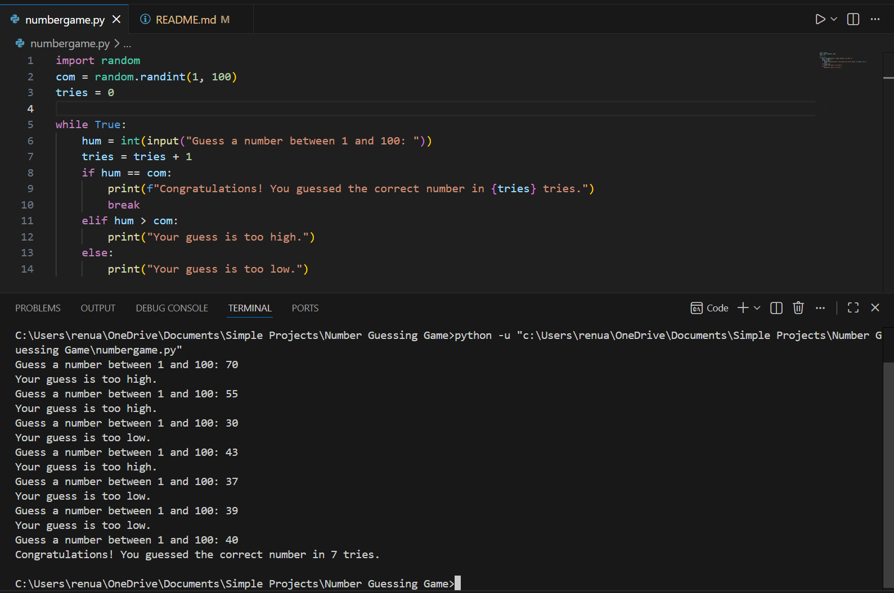

# 🎯 Number Guessing Game using Python

A simple and interactive command-line Number Guessing Game built using Python. The computer randomly selects a number between **1 and 100**, and the player has to guess it with the help of hints provided after each attempt.

The game continues until the correct number is guessed, and finally displays the total number of attempts taken.

---

## 🎮 Features

-  Random number generation between **1 and 100**
-  Hint if the guessed number is **too high**
-  Hint if the guessed number is **too low**
-  Unlimited guessing attempts
-  Displays the total number of attempts
-  Beginner-friendly command-line interface

---

## 🚀 Getting Started

### Prerequisites

Make sure you have **Python 3** installed.

Check your Python version:

```bash
python --version
```

No external libraries are required because this project only uses Python's built-in `random` module.

---

## ▶️ How to Run

### 1️⃣ Clone the repository

```bash
git clone https://github.com/Renukaparlikar26/number-guessing-game.git
```

### 2️⃣ Navigate to the project folder

```bash
cd number-guessing-game
```

### 3️⃣ Run the program

```bash
python number_guess.py
```

---

## 🎮 How to Play

1. The computer randomly selects a secret number between **1 and 100**.
2. Enter your guess in the terminal.
3. The game will provide one of the following hints:
   - 🔼 Your guess is too high.
   - 🔽 Your guess is too low.
4. Continue guessing until you find the correct number.
5. Once the correct number is guessed, the game displays the number of attempts taken.

---

## 📂 Project Structure

```
number-guessing-game/
│
├── images/
│   └── screenshot.png
│
├── number_guess.py
└── README.md
```

---

## 🖼️ Game Preview

### Screenshot



---

## 💻 Technologies Used

- Python 3
- Random Module

---

## 📌 Future Improvements

- 🎯 Difficulty Levels (Easy, Medium, Hard)
- 🔢 Limited Attempts
- 🔄 Play Again Option
- 🏆 High Score Tracking
- 💾 Save Best Score to File
- 🎨 GUI Version using Tkinter
- 🎮 Pygame Version
- 📈 Scoreboard
- ⏱️ Timer Mode

---

## 🤝 Contributing

Contributions are welcome!

If you'd like to improve this project:

1. Fork the repository
2. Create a new branch
3. Make your changes
4. Commit your changes
5. Open a Pull Request

---

## 🧑‍💻 Author

**Renuka**

GitHub: https://github.com/Renukaparlikar26

